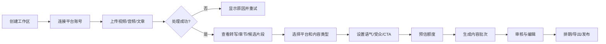
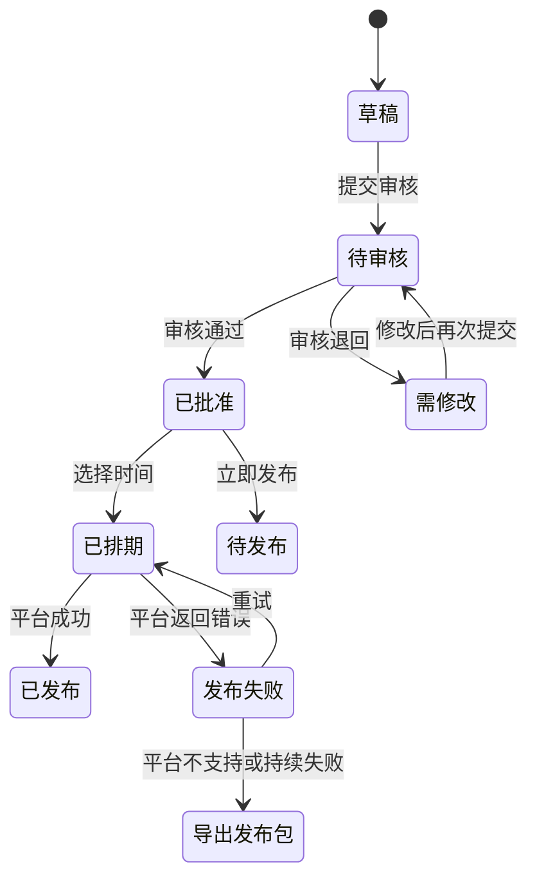
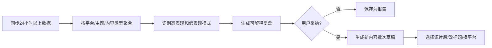

# SourceFlow 核心用户流程

## 1. 首次创建内容批次

### 关键异常

- 文件格式不支持：不进入 AI 队列，给出支持格式和转换建议。
- 转写失败：保留原文件，允许更换语言/重试。
- 额度不足：允许减少生成数量，或跳转购买额度。
- 平台未授权：允许先生成，发布时提醒连接账号。

## 2. 审核与发布

## 3. 数据复盘到下一批内容

## 4. 线索转化

1. 用户创建 CTA，选择短链、UTM 或表单。
2. 在内容批次级别绑定 CTA。
3. 生成平台版本时自动写入对应链接或发布说明。
4. 线索进入 SourceFlow 轻量列表。
5. 用户按平台、内容、CTA、时间筛选并导出。

## 5. 平台降级矩阵

| 场景 | 自动能力 | 降级体验 |
| --- | --- | --- |
| 平台支持发布和数据 | 自动排期、发布、回传 | 无 |
| 平台只支持数据 | 内容排期提醒、复制文案 | 一键复制媒体/文案 |
| 平台无稳定授权 | 不在后台宣称自动发布 | 下载 ZIP 发布包和发布清单 |
| 授权过期 | 暂停受影响排期 | 重新授权后自动恢复队列 |
| 发布失败 | 平台错误码和重试 | 连续失败后导出发布包 |
